# 🔎 Have a see inside

There is a lot of files inside ` sources/modules/templates ` but let's see what it all adds up to.

## 👊 Handlers

The purpose of these files is to manage interactions, events, database elements and tasks.

### Buttons

`buttons` → for your buttons

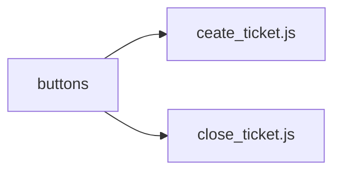

### Channels 

`channels` → 3 types of files are possible :
- those ending with `create.js` will be automatically launched when a channel is created
- those ending with `delete.js` will be automatically launched when a channel is deleted
- those ending with `update.js` will be automatically launched when a channel is updated

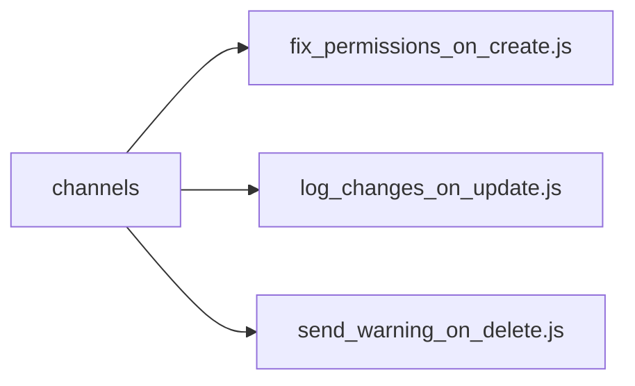

### Commands

`commands` → for your commands

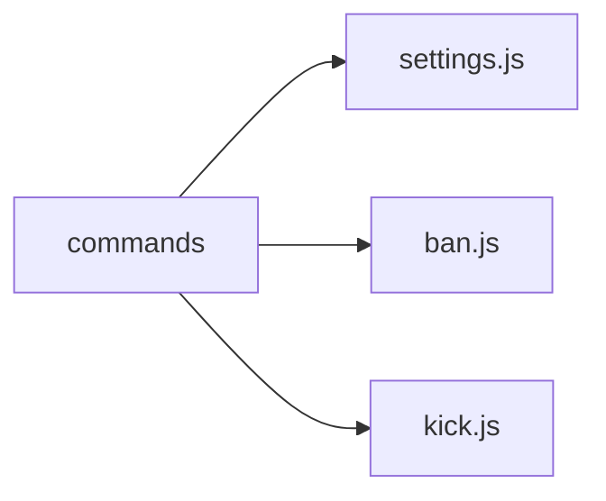

### Members

`members` → 3 types of files are possible :
- those ending with `join.js` will be automatically launched when a member joins a guild
- those ending with `leave.js` will be automatically launched when a member leaves a guild
- those ending with `update.js` will be automatically launched when a member is updated on a guild

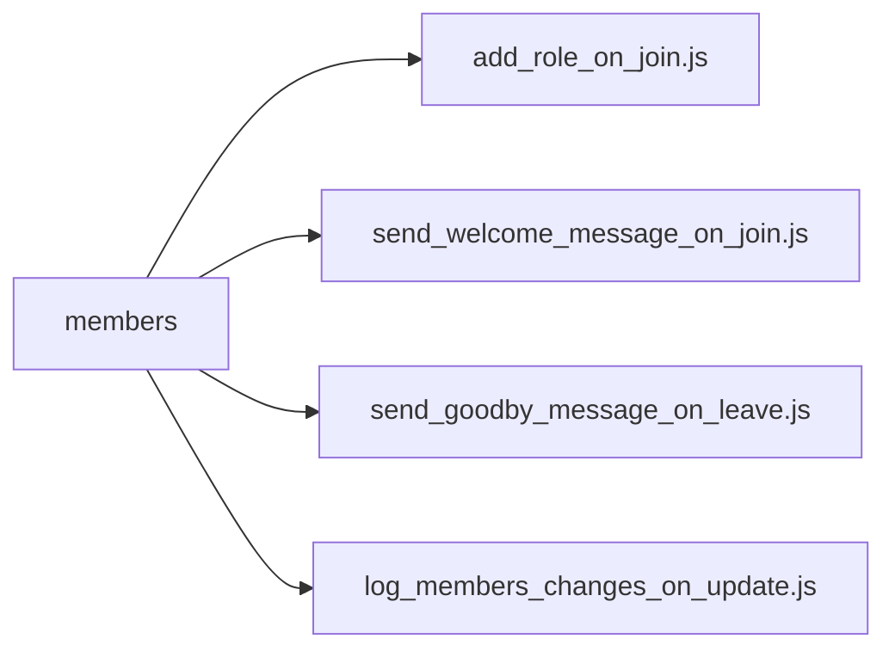

### Menus

`menus` → for your select menus

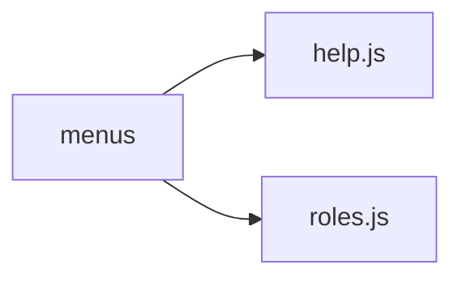

### Messages

`messages` → 3 types of files are possible :
- those ending with `create.js` will be automatically launched when a message is created
- those ending with `delete.js` will be automatically launched when a message is deleted
- those ending with `update.js` will be automatically launched when a message is updated

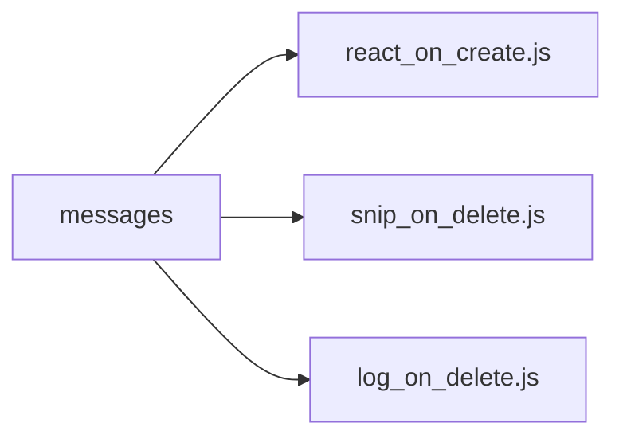

### Modals

`modals` → for your modals (forms)

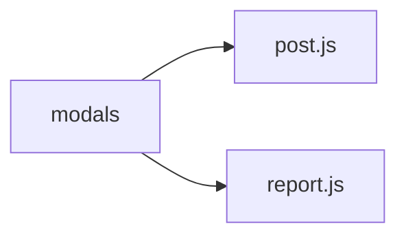

### Models

`models` → models are a quick and easy way of creating objects linked to your database; [please read the documentation](/clappybot/modules/models)

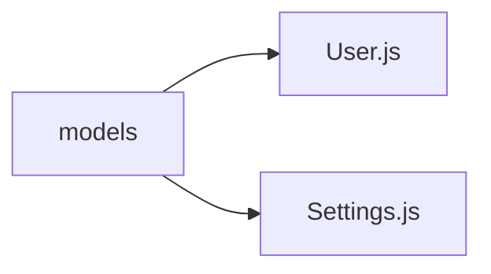

### Presences

`presences` → to check presences updates (status & activities of users and bots)

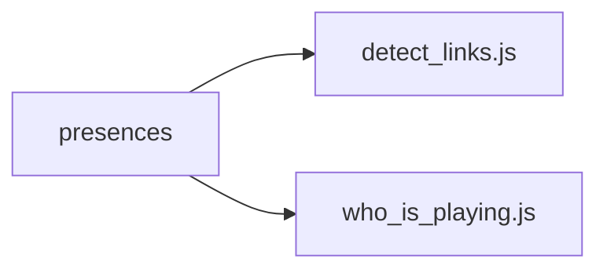

### Reactions

`reactions` → 2 types of files are possible :
- those ending with `add.js` will be automatically launched when a reaction is added to a message
- those ending with `remove.js` will be automatically launched when a reaction is removed from a message

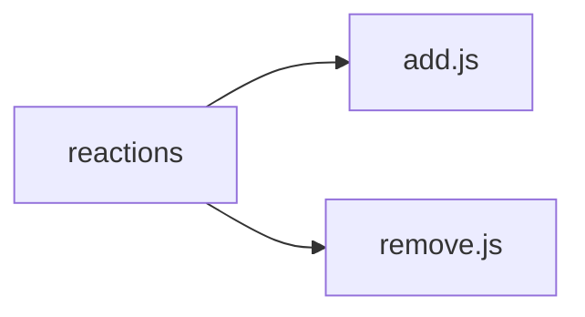

### Tasks

`tasks` → define recurring tasks such as an automatic message or checking for updates

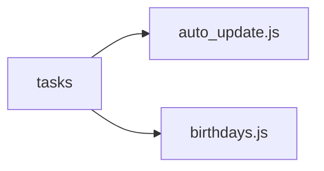

### ℹ️ Reminder
Each folder can contain as many files as necessary, please take care for folders that manage several
events (for example: create, update and delete events) to add the extension corresponding to the event
in question (channel_**create**.js, channel_**update**.js, channel_**delete**.js)

### 🧰 Utils
`utils` → You will notice that there is a `utils` folder, which is not automatically imported by the system, it is a totally optional folder which can have any other name (it doesn't matter) in which you save functions, classes or anything else that can be used in your module