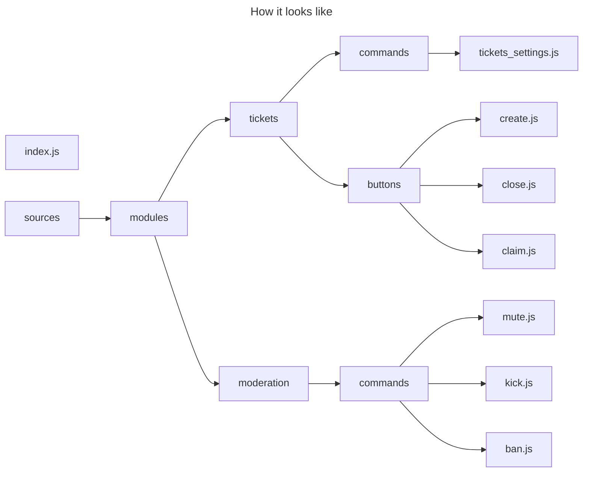

# 👋 Introduction

The very principle of this system is to allow you to create **Modules**.

## ℹ️ What is a module ?

It's a group of functions of the same nature or type, or functions that are supposed to work together
to create something more complex.

For example, the ` /kick `, ` /ban ` and ` /mute ` commands could be grouped together in a module called **Moderation**.

Another example: imagine a panel (embed) with a *contact staff* button, which opens a new channel with just
you and the staff. This is what is usually called a **Ticket Module**, which makes it easy to contact a server's staff in a private channel.



## ⚠️ Requirements 

If you haven't already cloned the [Module Template](https://github.com/LeWeeky/Module-template-for-clappybot),
you should do so, as it contains a bunch of examples that will make it much easier to create your own.
You can do this by copying and pasting the following command: 

```bash
git clone https://github.com/LeWeeky/Module-template-for-clappybot.git sources/modules/template
```

