# 🔎 Un coup d'œil

Il y a beaucoup de fichiers dans ` sources/modules/templates ` mais voyons à quoi tout ça peu servir.

## 👊 Gestionnaires

L'objectif de ces fichers est de gérer les intérations, évènements, éléments de base de données et tâches.

### Buttons

`buttons` → pour vos boutons

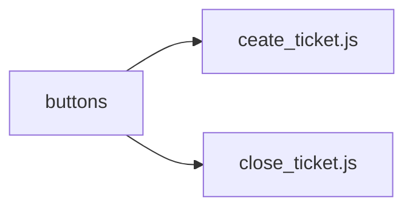

# Channels

`channels` → 3 types de fichiers possibles :
- ceux finissant par `create.js` seront automatiquement démarrés quand un salon est créé
- ceux finissant par `delete.js` seront automatiquement démarrés quand un salon est supprimé
- ceux finissant par `update.js` seront automatiquement démarrés quand un salon est mis à jour 

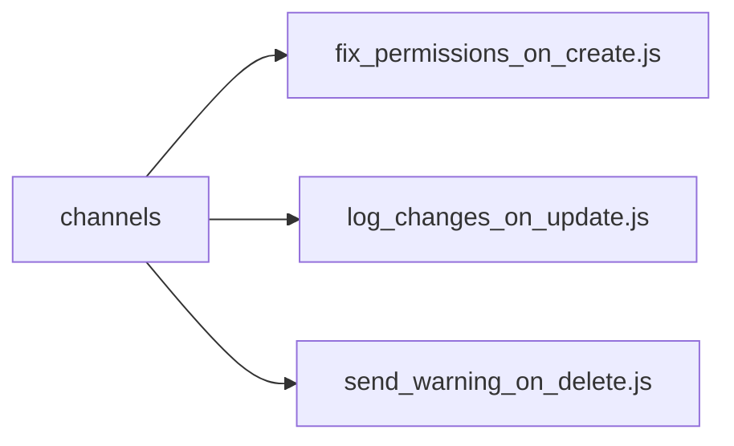

### Commands

`commands` → pour vos commandes

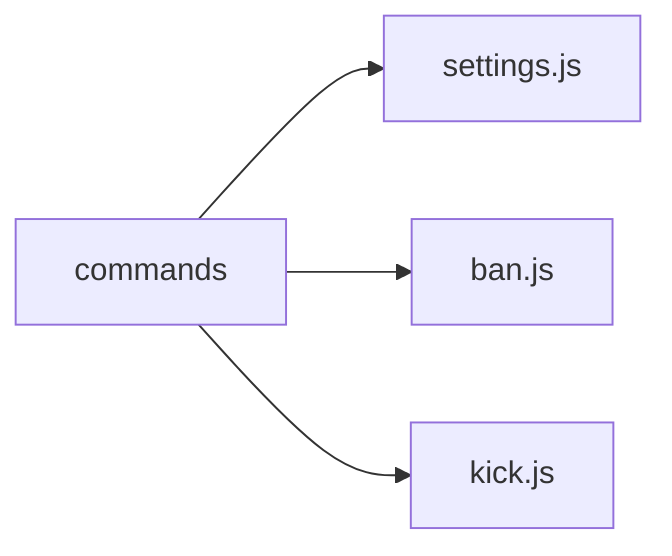

### Members

`members` → 3 types de fichiers possibles :
- ceux finissant par `join.js` seront automatiquement démarrés quand un membre rejoint un serveur
- ceux finissant par `leave.js` seront automatiquement démarrés quand un membre quitte un serveur
- ceux finissant par `update.js` seront automatiquement démarrés quand un membre est mis à jour sur un serveur

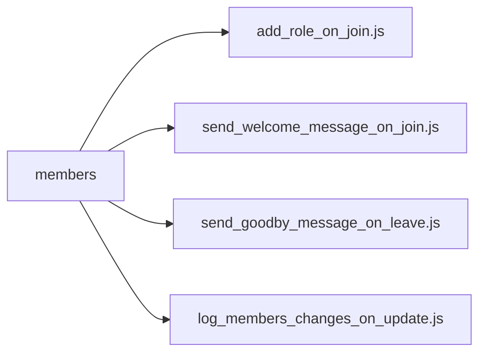

### Menus

`menus` → pour vos menus

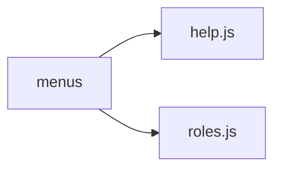

### Messages

`messages` → 3 types de fichiers possibles :
- ceux finissant par `create.js` seront automatiquement démarrés quand un message est créé
- ceux finissant par `delete.js` seront automatiquement démarrés quand un message est supprimé
- ceux finissant par `update.js` seront automatiquement démarrés quand un message est édité ou mis à jour
 
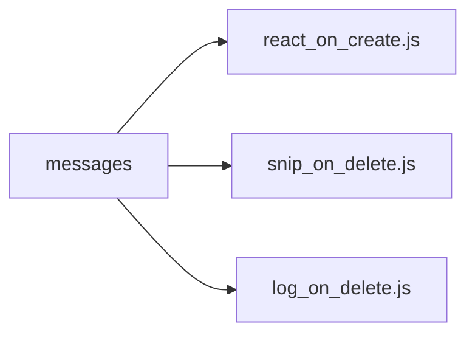

### Modals

`modals` → pour vos formulaires

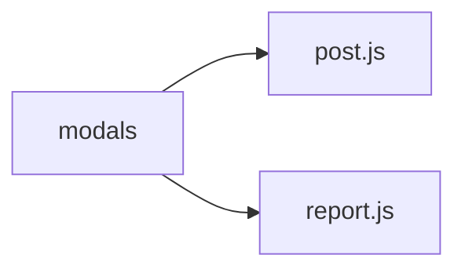

### Models

`models` → les modèles sont un moyen simple et rapide de créer des objects liés à votre base de données; pensez à [lire la documentation](/clappybot/modules/models)

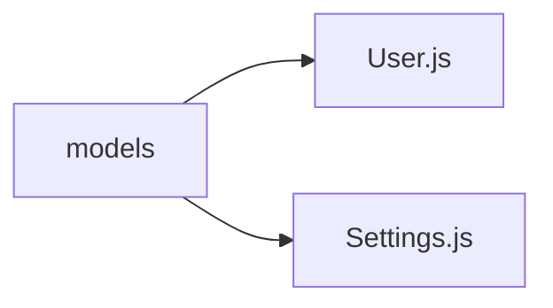

### Presence

`presences` → pour vérifier les mises à jours de statuts et activités des utilisateurs et bots
 
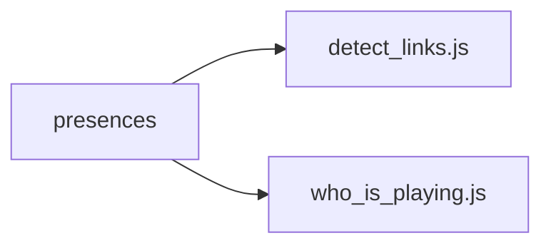

### Reactions

`reactions` → 2 types de fichiers possibles :
- ceux finissant par `add.js` seront automatiquement démarrés quand une réaction est ajoutée à un message
- ceux finissant par `remove.js` seront automatiquement démarrés quand une réaction est retirée d'un message

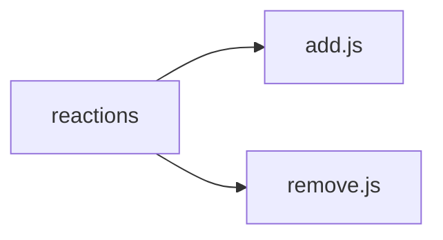

### Tasks

`tasks` → défini des tâches récurrentes comme des messages automatiques ou vérifications de mise à jours

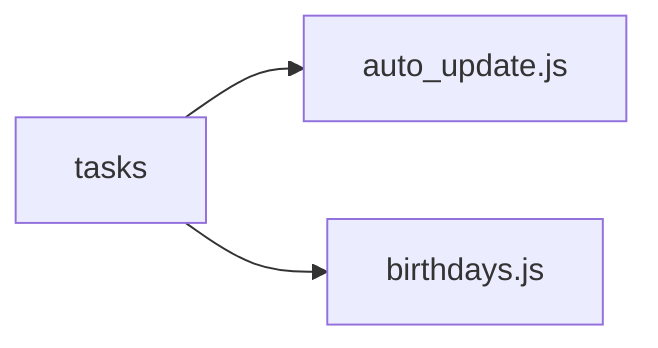

### ℹ️ Rappel

Chaque dossier peut contenir autant de fichiers que nécessaire, faites attention aux dossiers qui peuvent gérer plusieurs events (par exemple : create, update et delete) et ajoutez les extensions correspondantes (exemple : channel_**create**.js, channel_**update**.js, channel_**delete**.js)

### 🧰 Utils
Vous remarquerez qu'il y a un dossier `utiles`, celui-ci n'est pas automatiquement importé par le système, c'est un dossier totalement optionel (il peut même avoir le nom de votre choix), dedans vous pourrez installer vos fonctions, classes et tout ce dont vous aurez besoin plusieurs fois (dans plusieurs fichiers) dans votre module